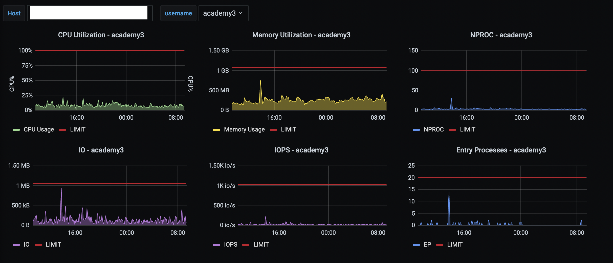

# CloudLinux LVE Exporter for Prometheus
LVE Exporter - A Prometheus exporter which scrapes metrics from CloudLinux LVE Stats 2

Help on flags:

<pre>
  -h, --help  Show context-sensitive help (also try --help-long and --help-man).
      --web.listen-address=":9119"
              Address to listen on for web interface and telemetry
</pre>

Tested on Cloud Linux 6, 7 & 8.
## Running as root (for testing only, not recommended for production)
```bash
# ./lve_exporter --web.listen-address=":9119"
```

## Running as Systemd Unit (with non-root user) - preferred method
- Download lve_exporter in /usr/local/bin/lve_exporter
- Create a regular user
```bash
# useradd --system --shell /bin/false prometheus
```
- Create a sudoers file, which will allow executing of cloudlinux-statistics without asking for password
```bash
# cat <<EOF >> /etc/sudoers.d/prometheus
prometheus ALL=NOPASSWD: /usr/sbin/cloudlinux-statistics --json
EOF
```
- Create systemd unit
```bash
# cat <<EOF >> /etc/systemd/system/lve_exporter.service
[Unit]
Description=LVE Exporter

[Service]
User=prometheus
Group=prometheus
EnvironmentFile=/etc/sysconfig/lve_exporter
ExecStart=/usr/local/bin/lve_exporter \$OPTIONS

[Install]
WantedBy=multi-user.target
EOF
```
- Reload systemd and enable service
```bash
# systemctl daemon-reload
# systemctl enable --now lve_exporter.service
```
## Collectors

LVE metrics:

```
# HELP LVE_CPU_FAULTS CPU limit per user in LVE
# TYPE LVE_CPU_FAULTS gauge
# HELP LVE_CPU_LIMIT CPU limit per user in LVE
# TYPE LVE_CPU_LIMIT gauge
# HELP LVE_CPU_USAGE CPU usage per user in LVE
# TYPE LVE_CPU_USAGE gauge
# HELP LVE_EP_FAULTS Entry Processes Faults per LVE user
# TYPE LVE_EP_FAULTS gauge
# HELP LVE_EP_LIMIT Entry Processes Limit per LVE user
# TYPE LVE_EP_LIMIT gauge
# HELP LVE_EP_USAGE Entry Processes per LVE user
# TYPE LVE_EP_USAGE gauge
# HELP LVE_IOPS_FAULTS IOPS Faults per LVE user
# TYPE LVE_IOPS_FAULTS gauge
# HELP LVE_IOPS_LIMIT IOPS Limit per LVE user
# TYPE LVE_IOPS_LIMIT gauge
# HELP LVE_IOPS_USAGE IOPS per LVE user
# TYPE LVE_IOPS_USAGE gauge
# HELP LVE_IO_FAULTS IO Faults per LVE user
# TYPE LVE_IO_FAULTS gauge
# HELP LVE_IO_LIMIT IO Limit per LVE user
# TYPE LVE_IO_LIMIT gauge
# HELP LVE_IO_USAGE IO per LVE user
# TYPE LVE_IO_USAGE gauge
# HELP LVE_NPROC_FAULTS Faults for Nummber of processes per LVE user
# TYPE LVE_NPROC_FAULTS gauge
# HELP LVE_NPROC_LIMIT Limit for Nummber of processes per LVE user
# TYPE LVE_NPROC_LIMIT gauge
# HELP LVE_NPROC_USAGE Nummber of processes per LVE user
# TYPE LVE_NPROC_USAGE gauge
# HELP LVE_PMEM_FAULTS Phisical memory faults per user in LVE
# TYPE LVE_PMEM_FAULTS gauge
# HELP LVE_PMEM_LIMIT Phisical memory limit per user in LVE
# TYPE LVE_PMEM_LIMIT gauge
# HELP LVE_PMEM_USAGE Physical memory usage per user in LVE
# TYPE LVE_PMEM_USAGE gauge
# HELP LVE_VMEM_FAULTS Virtual memory faults per user in LVE
# TYPE LVE_VMEM_FAULTS gauge
# HELP LVE_VMEM_LIMIT Virtual memory limit per user in LVE
# TYPE LVE_VMEM_LIMIT gauge
# HELP LVE_VMEM_USAGE Virtual memory usage per user in LVE
# TYPE LVE_VMEM_USAGE gauge
```

## TODO
Add example grafana dashboards
